<div align="center">

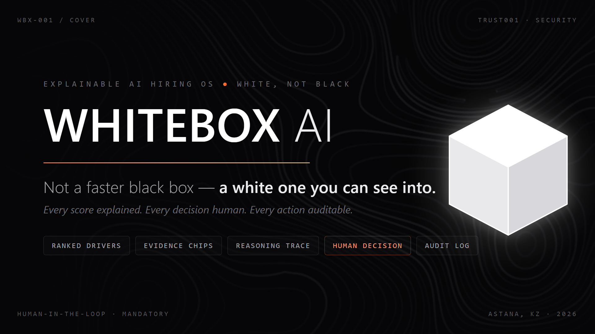

<br/><br/>


</div>

---

## 🕳 The problem

Companies receive hundreds to thousands of applications per role and lean on
AI/ATS screening that decides who ever reaches a human — as a **black box**:

- ❌ Candidates never learn *why* they were rejected.
- ❌ Recruiters can't see *which factors* drove a score.
- ❌ Résumé keywords dominate, while communication and problem-solving are
  barely assessed.
- ❌ Regulators now treat hiring AI as **high-risk** (EU AI Act, NYC Local Law
  144), yet most tools have no auditable way to prove fair screening.

## 💡 The answer

WhiteBox AI runs the first screening stage end to end — a structured AI
interview, evidence-linked scoring — but never makes the final call. **A named
human always decides**, and every score ships with:

| | |
|---|---|
| 🥇 | **Ranked drivers** — the factors that pushed a score up or down |
| 🧾 | **Evidence chips** — every claim linked back to an interview transcript fragment |
| 🔍 | **A frozen rubric** — vacancy criteria, weights, and governance are versioned; scores stay bound to the exact version they were judged against |
| ✋ | **Mandatory human exit** — accept / hold / request more evidence / reject-with-reason, written to an append-only, hash-chained audit log |

This repository is the **unified demo build**: a working Next.js app that runs
the whole loop locally, in demo mode, with synthetic candidates.

---

## 🖥 Product tour

### HR side

| Dashboard | AI-generated role profile |
|---|---|
| 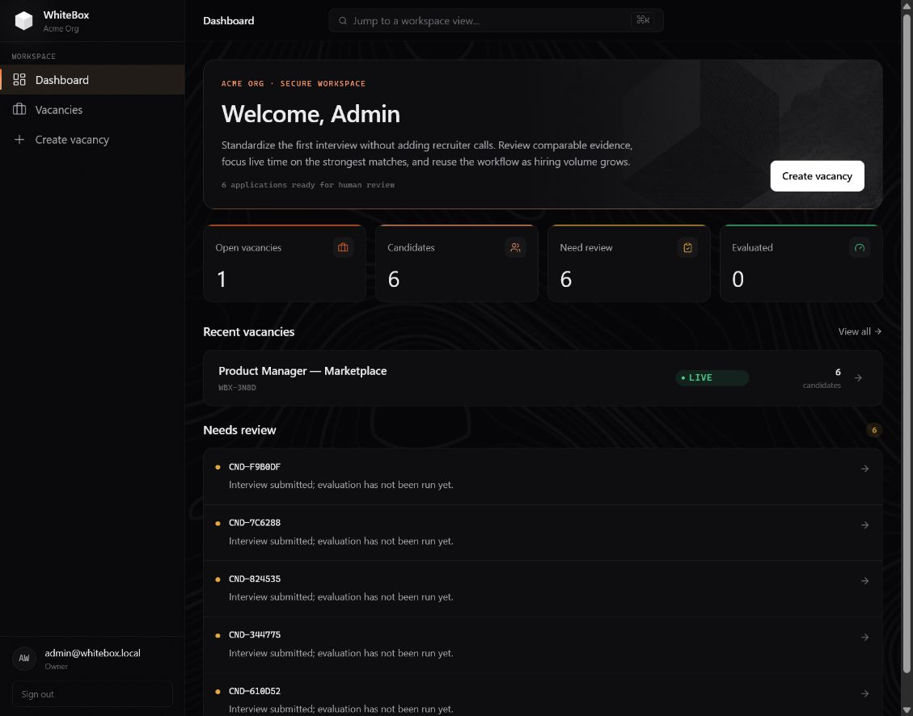 | 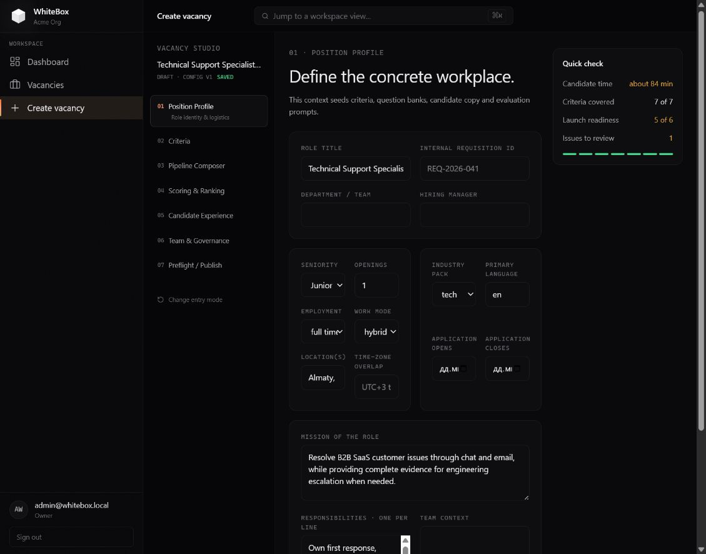 |

| Scoring & ranking logic | Governance & human review |
|---|---|
| 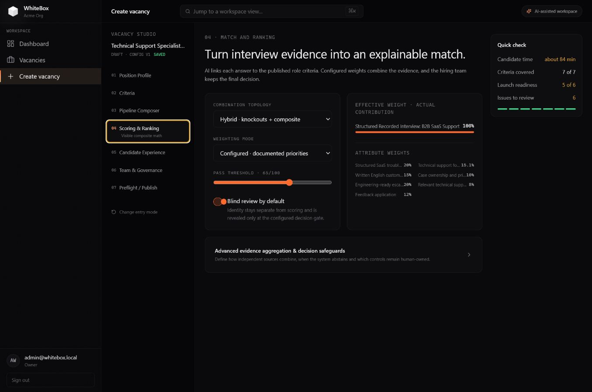 | 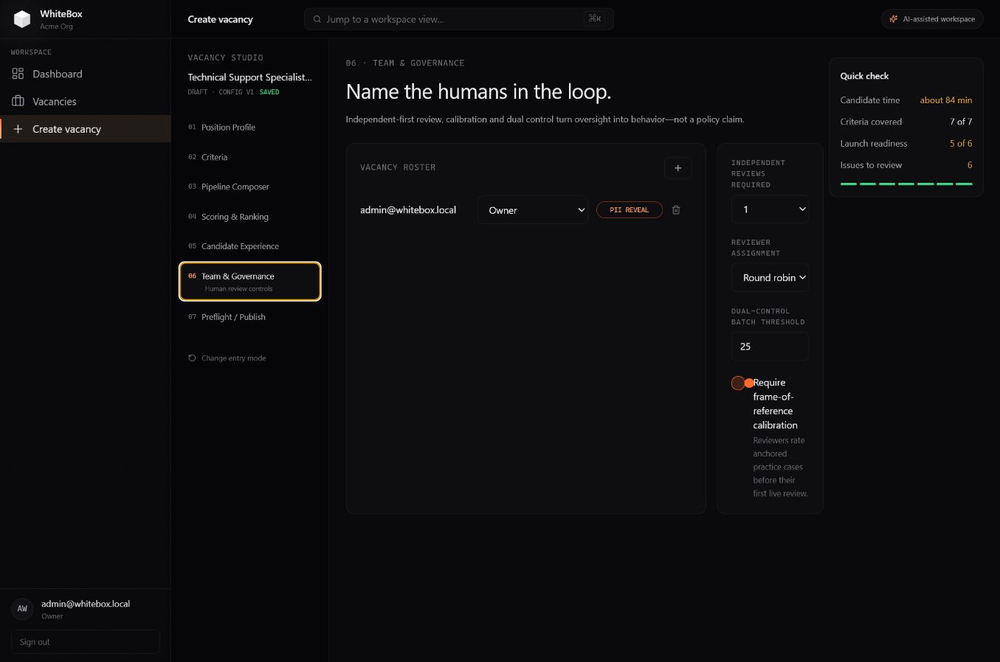 |

### Candidate side

| Code entry | System check |
|---|---|
| 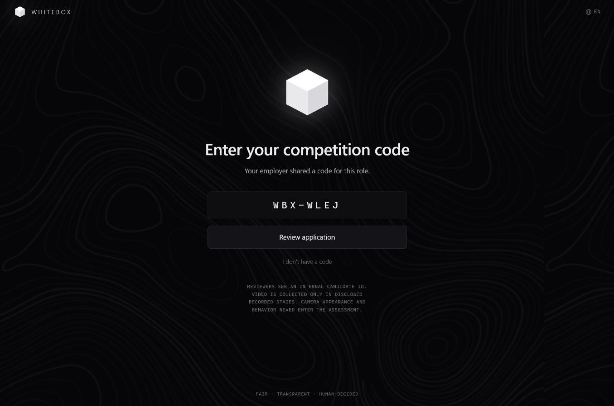 | 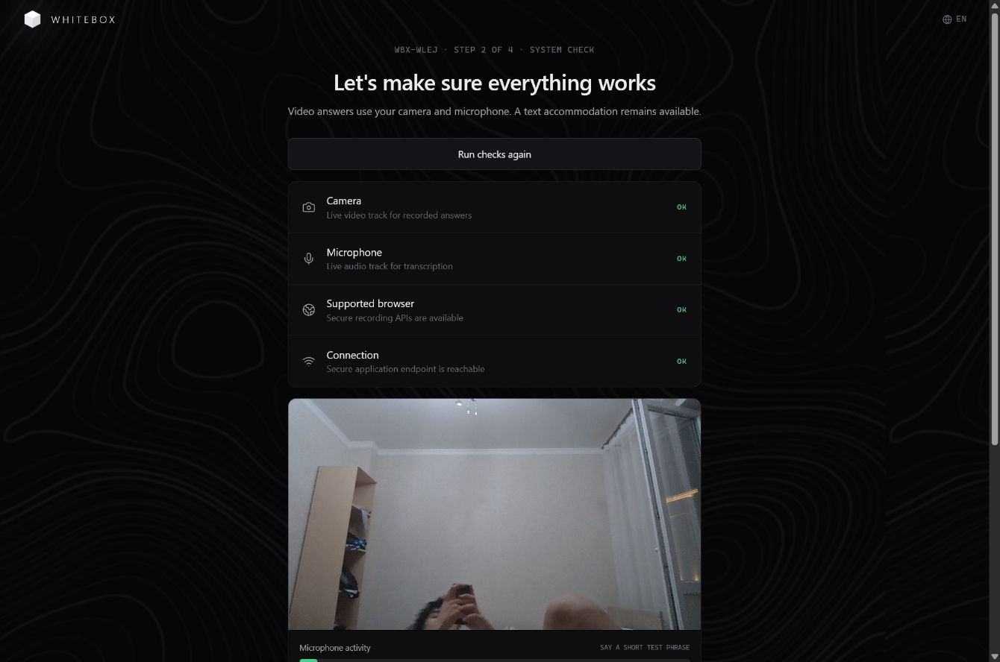 |

| Live recorded interview | Interview complete |
|---|---|
| 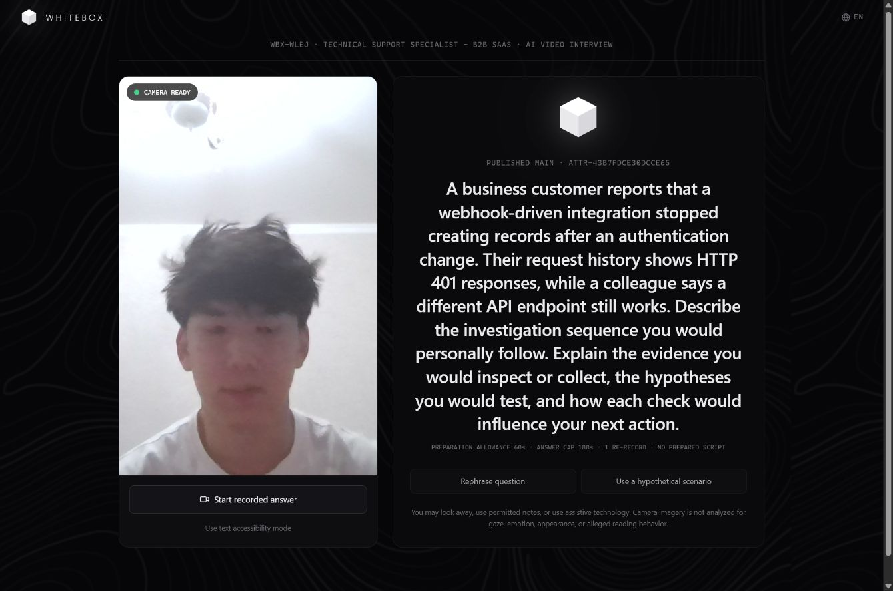 | 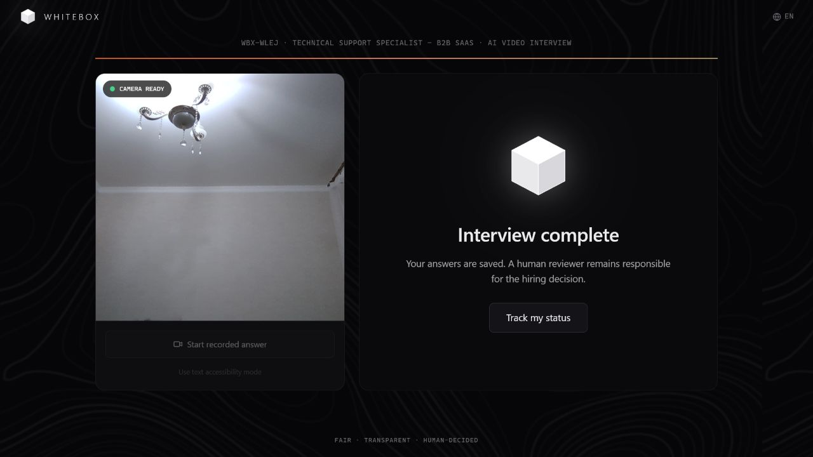 |

### 🎬 Full walkthrough

A 75–90s silent pitch demo (HR creates a vacancy → candidate completes a
recorded AI interview → HR reviews an evidence-linked scorecard) is included at
[`demo-output/whitebox-pitch-demo.mp4`](demo-output/whitebox-pitch-demo.mp4).
See [`DEMO_SCENARIO.md`](DEMO_SCENARIO.md) for the shot-by-shot script.

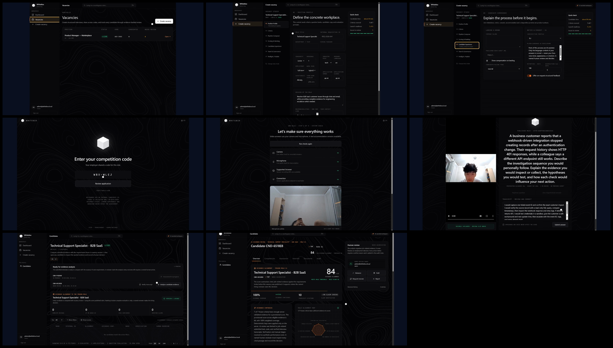

---

## ⚙️ How it works

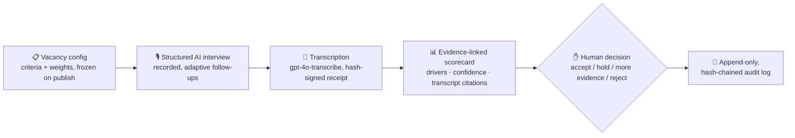

- A vacancy freezes its job analysis, criteria, evidence methods, stages,
  BARS rubrics, weights, and governance into one version — candidate
  submissions and reviewer scores stay bound to that exact version.
- AI authoring and scoring are **real-provider-only**: they never fall back to
  deterministic text when OpenAI is unavailable — they fail closed instead.
- Camera appearance, voice characteristics, gaze, emotion, and background are
  **never** collected as evaluation signals; scoring only ever sees a
  provider-verified or human-verified transcript plus the published rubric.

---

## 🚀 Run the development demo

Requirements: Node.js 24 and npm. FFprobe is only required for the production
media-validation path — the development demo does not need it.

Create `.env.local` with development-safe settings only:

```dotenv
NODE_ENV=development
NEXT_PUBLIC_APP_URL=http://localhost:3100
WBX_DEMO_MODE=true
```

Then run:

```sh
npm ci
npm run dev -- --port 3100
```

Open `http://localhost:3100`.

| | |
|---|---|
| Candidate code | `WBX-3N8D` |
| Already-submitted candidate code | `WBX-7Q4K` |
| HR login | `admin@whitebox.local` |
| HR password | `WhiteBox!2026` |

Demo transcripts deliberately fail closed until an HR reviewer opens **Review
transcripts**, compares each clip, and records a human verification. Use
synthetic people and answers only.

In local development, when `OPENAI_API_KEY` isn't already set, the server may
read a key from an ignored root `API.md` file — excluded from Git and from the
Docker build context. Production always requires `OPENAI_API_KEY` as a managed
server-side secret instead.

### Validate

```sh
npm run lint
npm run typecheck
npm run test
npm run build
```

With the app running on port 3100, `npm run test:e2e` drives the full
candidate + HR journey with synthetic camera/microphone devices — it never
touches a developer's real camera.

---

## 🔒 Privacy boundary

- Production recordings go to a private S3-compatible bucket via server-side
  SigV4 requests; no bucket URL or presigned object URL ever reaches the
  browser. HR playback is served through an authenticated, same-origin proxy.
- Development demo mode stores files under `.data/recordings` — local-only,
  Git-ignored, and unavailable in production.
- `npm run retention:run` atomically removes expired candidate identity,
  consent telemetry, transcripts, and evaluation output once retention
  expires, replacing application state with a minimal tombstone.

Full production requirements (PostgreSQL migrations, independent signing
secrets, FFprobe, trusted ingress, S3 encryption, retention/deletion
workflow) are in [DEPLOYMENT.md](DEPLOYMENT.md); the security boundary is in
[SECURITY.md](SECURITY.md).

---

## 🗺 Main routes

| Surface | Route |
| --- | --- |
| Candidate code entry | `/` |
| Candidate device check and consent | `/interview/check` |
| Recorded interview | `/interview/live` |
| Candidate status | `/status` |
| Secure referee questionnaire | `/reference/:opaqueToken` |
| HR login | `/login` |
| HR dashboard | `/dashboard` |
| Vacancies | `/vacancies` |
| Candidate ranking | `/vacancies/:id/ranking` |
| HR transcript provenance review | `/vacancies/:id/applications/:applicationId/transcripts` |
| Candidate scorecard | `/vacancies/:id/candidates/:candidateId` |
| Liveness probe | `/api/health/live` |
| Production readiness probe | `/api/health/ready` |

## 🧱 Repository map

| Path | Purpose |
| --- | --- |
| `app/` | Next.js pages and API routes |
| `lib/server/ai-provider.ts` | Vacancy authoring, interview routing, transcription, evidence-evaluation providers |
| `lib/server/media.ts` | Upload validation, private storage, receipts, playback reads, deletion primitives |
| `lib/server/transcript-provenance.ts` | Transcript hashing, correction diffing, fail-closed selection, human verification |
| `lib/server/reference-checks.ts` | Expiring single-use referee invitations and immutable structured-response receipts |
| `lib/server/video-analysis.ts` | FFprobe A/V track and duration verification |
| `lib/server/repository.ts` | PostgreSQL and development-demo persistence |
| `db/migrations/` | Relational schema, recording metadata, video-only media constraint |
| `scripts/migrate.mjs` | Ordered transactional migrations and owner bootstrap |
| `scripts/retention-worker.mjs` | Relational-data retention worker |
| `e2e-test.mjs` | Candidate and HR browser journey |
| `styles/tokens.css` | Visual design tokens |
| `WhiteBoxAIMASTERDOC.md` | Product and design reference |

---

<div align="center">

**Status:** working unified demo · synthetic data only

*The AI never makes the hiring decision — it structures evidence. A named human always decides.*

</div>
